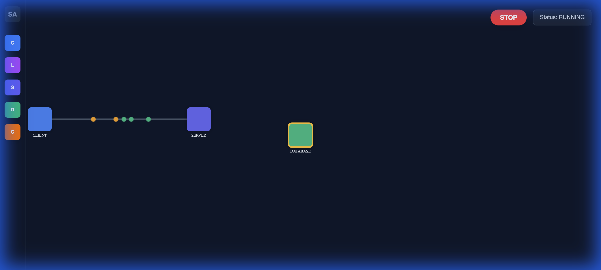
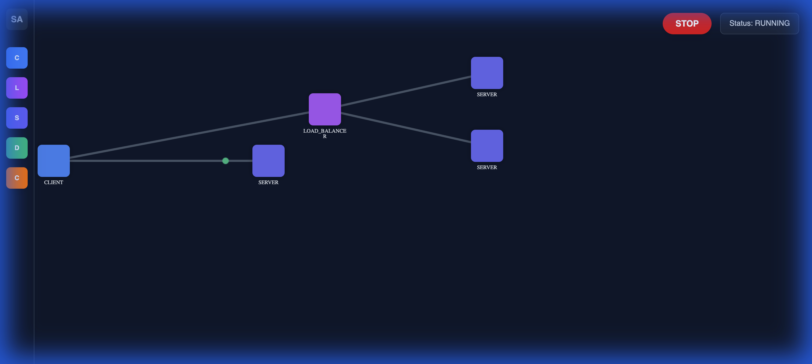
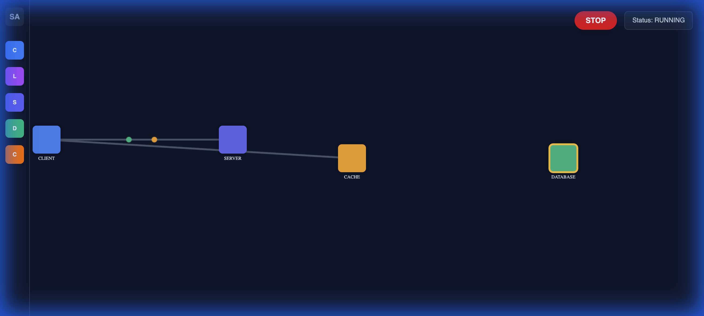

# SysArch Interactive
**A deterministic system design simulator for visualizing and testing distributed architectures.**

[](https://opensource.org/licenses/MIT)
[](https://reactjs.org/)
[](https://www.typescriptlang.org/)
[](https://vitejs.dev/)
[](https://tailwindcss.com/)

**SysArch Interactive** is a web-based educational tool that allows users to interactively build, simulate, and understand complex distributed system architectures. It combines a physics-based particle engine with a drag-and-drop builder to visualize traffic flow, latency, and load balancing in real-time.



## Features

*   **Interactive Builder**: Drag and drop components onto an infinite canvas to design your architecture.
*   **Physics-Based Simulation**: Visualize individual requests as particles traveling through your system.
*   **Real-Time Configuration**: Adjust parameters like Latency, RPS, and Capacity on the fly.
*   **Component Types**:
    *   **Client**: Generates traffic with configurable Requests Per Second (RPS).
    *   **Load Balancer**: Distributes traffic using Round Robin/Random logic.
    *   **Server**: Processes requests with concurrent capacity limits.
    *   **Database**: Simulates processing latency (requests wait at the node).
    *   **Cache**: Implements Hit/Miss logic to optimize traffic flow.
*   **Visual Feedback**: Nodes change color based on health/load; queue sizes are visualized.
*   **Export**: Save your architecture designs as high-resolution images.

## Getting Started

### Prerequisites

*   Node.js (v16+)
*   npm or yarn

### Installation

1.  Clone the repository:
    ```bash
    git clone https://github.com/pronzzz/sysarch-interactive.git
    cd sysarch-interactive
    ```

2.  Install dependencies:
    ```bash
    npm install
    # or
    yarn install
    ```

3.  Start the development server:
    ```bash
    npm run dev
    # or
    yarn dev
    ```

4.  Open http://localhost:5173 to start building!

## Usage Guide

### 1. Building an Architecture
- Open the **Toolbar** on the left.
- Drag components (Client, Server, LB, DB, Cache) onto the canvas.
- Click a **Source** node and then a **Target** node to create a connection (Edge).

### 2. Configuring Nodes
- Click on any node to select it.
- Uses the **Properties Panel** on the right to adjust settings:
    - **Client**: Increase RPS to generate more load.
    - **Server**: Adjust Capacity to see how it handles concurrency.
    - **Database**: Increase Latency to simulate slow queries.
    - **Cache**: Adjust Hit Rate to see the effect on backend load.

### 3. Simulation
- Click **START TRAFFIC** in the top-right overlay.
- Watch particles (requests) flow through the system.
- Blue/Orange particles are Requests; Green particles are Responses.
- Nodes will turn **Red** if they are overloaded.

## Walkthrough & capabilities

### Phase 1: The Engine
We implemented a custom physics engine using `requestAnimationFrame` to handle thousands of particles efficiently.


### Phase 2: The Builder
An infinite canvas with pan/zoom capabilities and drag-and-drop node placement.


### Phase 3: Logic & Load Balancing
Implemented intelligent routing. Load balancers split traffic between multiple servers.


### Phase 4: Database & Cache
Added realistic behaviors. Databases simulate delay, and Caches intercept requests.


### Phase 5: Polish
Finalized with a Properties Inspector for runtime changes and visual health indicators.


## License

This project is licensed under the MIT License - see the [LICENSE](LICENSE) file for details.
